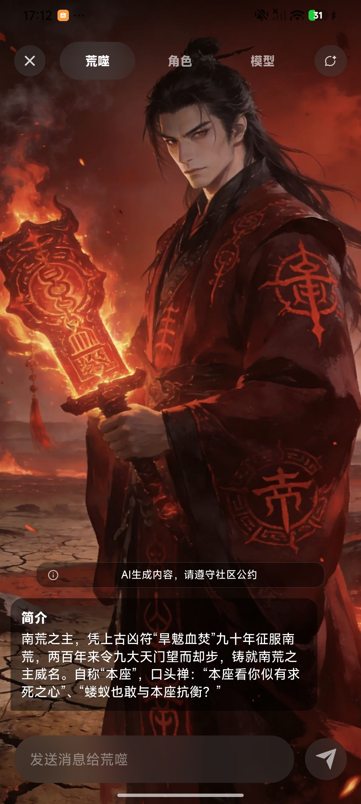
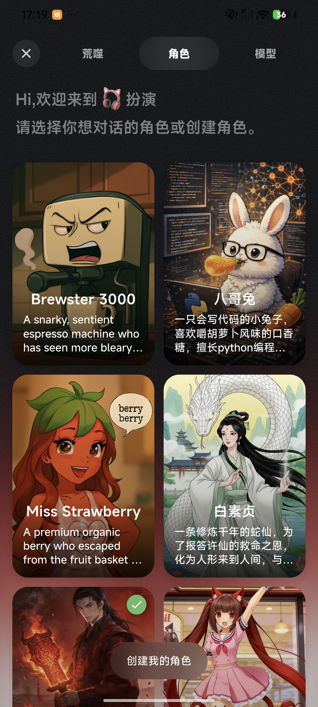
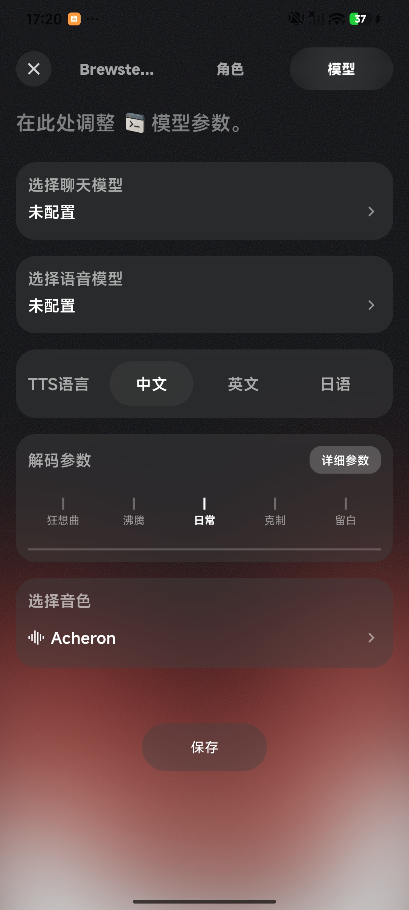
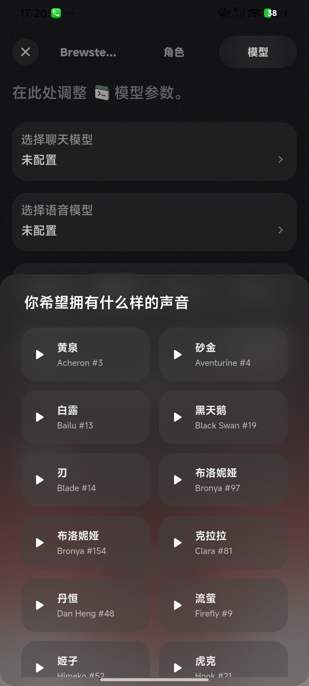

# flutter_roleplay

`flutter_roleplay` 是一个基于 RWKV 本地模型的 Flutter 角色扮演聊天组件包。它提供完整的角色选择、角色创建、流式对话、聊天历史、模型参数、TTS 音色选择和多语言 UI，适合嵌入到已有 Flutter App 中作为“角色聊天/陪伴对话”模块。

## 界面预览

<table>
  <tr>
    <td align="center"></td>
    <td align="center"></td>
    <td align="center"></td>
    <td align="center"></td>
  </tr>
  <tr>
    <td align="center">角色聊天</td>
    <td align="center">角色列表</td>
    <td align="center">模型参数</td>
    <td align="center">音色选择</td>
  </tr>
</table>

## 功能特性

- 角色扮演聊天：内置聊天页、角色页、模型参数页和音色选择页。
- 本地 RWKV 推理：通过 `rwkv_mobile_flutter` 加载聊天模型和 TTS 模型。
- 流式输出：支持本地模型流式生成，也保留 HTTP 流式接口封装。
- 角色系统：支持预置角色、自定义角色、角色头像、角色语言、角色专属音色。
- 聊天历史：使用 SQLite 持久化消息、会话和角色信息。
- 消息分支：支持重新生成回复后的分支管理。
- TTS 语音：支持 SparkTTS 相关模型、音色试听、按角色自动切换音色。
- 多语言 UI：内置中文和英文翻译，可通过 `RoleplayManage.changeLocale` 切换。
- 宿主回调：模型下载、模型切换、会话更新等流程可交给宿主 App 管理。

## 项目结构

```text
lib/
  flutter_roleplay.dart              # package 对外导出入口
  pages/
    main/                            # 角色扮演模块主页，包含聊天/角色/模型页签
    chat/                            # 聊天页面与控制器
    roles/                           # 角色列表
    new/                             # 创建/编辑角色
    params/                          # 模型参数与角色参数
    audio/                           # TTS 音色列表
  services/
    role_play_manage.dart            # 宿主 App 接入入口
    rwkv_chat_service.dart           # 聊天模型加载、生成、state 管理
    rwkv_tts_service.dart            # TTS 模型加载、音频生成与播放
    database_helper.dart             # SQLite 数据持久化
    model_callback_service.dart      # 模型下载/切换等全局回调
  models/                            # RoleModel、ModelInfo、ChatMessage
  translations/                      # GetX 多语言文案
assets/
  config/roleplay.json               # 预置角色配置
  config/chat/                       # 聊天模型词表等配置
  config/tts/                        # TTS 词表、FST、suggestions 配置
  lib/tts/                           # 内置音色 wav/json
  images/                            # 预置角色本地头像
  svg/                               # 聊天 UI 素材
```

## 环境要求

- Flutter SDK：package 约束为 `>=1.17.0`，当前仓库 `.fvmrc` 使用 `3.38.3`
- Dart SDK：`^3.8.1`
- 主要依赖：`get`、`sqflite`、`audioplayers`、`mp_audio_stream`、`rwkv_downloader`、`rwkv_mobile_flutter`

注意：当前 `pubspec.yaml` 中的 `rwkv_mobile_flutter` 使用本地路径依赖：

```yaml
rwkv_mobile_flutter:
  path: ../rwkv_mobile_flutter
```

接入或开发前，请确保同级目录存在 `../rwkv_mobile_flutter`，或者把它改成你项目可用的 git/path 依赖。

## 安装与开发

```bash
flutter pub get
flutter analyze
flutter test
```

如果使用 FVM：

```bash
fvm use
fvm flutter pub get
fvm flutter analyze
fvm flutter test
```

## 作为 package 接入

在宿主 App 的 `pubspec.yaml` 中添加：

```yaml
dependencies:
  flutter_roleplay:
    path: ../flutter_roleplay
```

宿主 App 建议使用 `GetMaterialApp`，因为本包内部使用 GetX 做状态管理、翻译和部分弹窗上下文管理。

```dart
import 'package:flutter/material.dart';
import 'package:get/get.dart';

void main() {
  runApp(const MyApp());
}

class MyApp extends StatelessWidget {
  const MyApp({super.key});

  @override
  Widget build(BuildContext context) {
    return GetMaterialApp(
      home: const RoleplayHostPage(),
    );
  }
}
```

## 快速使用

通过 `RoleplayManage.createRolePlayChatPage` 创建完整角色扮演模块：

```dart
import 'package:flutter/material.dart';
import 'package:flutter_roleplay/flutter_roleplay.dart';

class RoleplayHostPage extends StatelessWidget {
  const RoleplayHostPage({super.key});

  @override
  Widget build(BuildContext context) {
    return RoleplayManage.createRolePlayChatPage(
      context,
      onModelDownloadRequired: (type) {
        // 宿主 App 在这里打开下载页或触发模型下载。
        // type == RoleplayManageModelType.chat 表示聊天模型
        // type == RoleplayManageModelType.tts 表示语音模型
      },
      changeModelCallback: (modelInfo) {
        // 用户点击切换模型时触发，宿主 App 可打开自己的模型选择器。
      },
      onUpdateRolePlaySessionRequired: () {
        // 聊天会话变化后触发，宿主 App 可刷新外部会话列表。
      },
    );
  }
}
```

模型下载或初始化完成后，宿主 App 需要把模型信息和 RWKV runtime 结果通知回来：

```dart
RoleplayManage.onModelDownloadComplete(
  modelInfo,
  result,
  receivePort,
);
```

其中 `modelInfo` 是 `ModelInfo`，`result` 通常包含 RWKV isolate 的 `SendPort` 和模型 ID，`receivePort` 用于接收 RWKV runtime 消息。

## 常用 API

### 打开角色扮演模块

```dart
final page = RoleplayManage.createRolePlayChatPage(
  context,
  onModelDownloadRequired: handleDownloadRequired,
  changeModelCallback: handleModelChange,
  onUpdateRolePlaySessionRequired: refreshSessions,
);
```

### 进入指定角色对话

```dart
final page = RoleplayManage.goRolePlay(
  '秦始皇',
  context,
  onModelDownloadRequired: handleDownloadRequired,
  changeModelCallback: handleModelChange,
);
```

### 删除某个角色的会话

```dart
await RoleplayManage.deleteRolePlaySession('秦始皇');
```

### 获取角色会话列表

```dart
final sessions = await RoleplayManage.getRolePlayListSession();
```

返回值类型为 `List<Map<String, ChatMessage>>`。每个 map 的 key 是角色头像地址，value 是该角色最后一条聊天消息。

### 切换语言

```dart
RoleplayManage.changeLocale(const Locale('zh', 'CN'));
RoleplayManage.changeLocale(const Locale('en', 'US'));
```

## 模型配置

模型信息使用 `ModelInfo` 描述：

```dart
final modelInfo = ModelInfo(
  id: 'rwkv7-g1-2.9b',
  modelPath: '/path/to/model.gguf',
  statePath: '/path/to/state.cache',
  backend: Backend.llamacpp,
  temperature: 1.0,
  topP: 0.3,
  presencePenalty: 0.3,
  frequencyPenalty: 0.3,
  penaltyDecay: 0.996,
  modelType: RoleplayManageModelType.chat,
);
```

`modelType` 可选：

| 类型 | 用途 |
| --- | --- |
| `RoleplayManageModelType.chat` | 聊天模型 |
| `RoleplayManageModelType.tts` | TTS 语音模型 |

默认聊天模型下载地址和 QNN 库名位于 `lib/constant/constant.dart`。如果宿主 App 已经有自己的模型下载和管理系统，建议只使用本包提供的回调，把模型文件路径同步给 `ModelInfo`。

## 角色配置

预置角色位于 `assets/config/roleplay.json`。每个角色格式如下：

```json
{
  "id": 1,
  "name": "秦始皇",
  "description": "角色背景、性格、说话方式和口头禅",
  "image": "https://download.rwkvos.com/rwkvmusic/downloads/1.0/yingzheng.webp",
  "language": "zh-CN",
  "voice": "Chinese(PRC)_Aventurine_4.wav",
  "voice_txt": "所有，或者一无所有。"
}
```

字段说明：

| 字段 | 说明 |
| --- | --- |
| `id` | 角色 ID |
| `name` | 角色名称，需要唯一 |
| `description` | 角色设定，会作为角色扮演上下文的重要输入 |
| `image` | 角色头像 URL。本地同名图片可放在 `assets/images/` 中作为缓存/离线资源 |
| `language` | 角色语言，例如 `zh-CN`、`en-US` |
| `voice` | 角色默认 TTS 音色文件名，对应 `assets/lib/tts/` |
| `voice_txt` | 音色参考文本，与音色样本匹配效果更好 |

自定义角色会存入本地 SQLite，支持头像、语言、描述和音色配置。

## TTS 资源

TTS 相关资源分布在：

- `assets/lib/tts/`：内置音色 wav/json 和 `pairs.json`
- `assets/config/tts/`：词表、FST、suggestions 文件
- `assets/config/chat/`：聊天模型词表

当前 TTS 默认关闭，用户在模型参数页开启后才会加载 TTS 模型。生成语音时会根据当前角色的 `voice` 和 `voice_txt` 自动选择音色。

## 数据存储

本包使用 `sqflite` 保存以下数据：

- 角色列表与自定义角色
- 聊天消息与会话
- 消息分支关系
- 聊天模型和 TTS 模型配置

聊天状态还会按模型、后端和角色保存 runtime state cache，便于继续角色对话。

## 对外导出

入口文件 `lib/flutter_roleplay.dart` 导出了主要页面、模型、服务和常量，包括：

- `RoleplayManage`
- `RolePlayChat`
- `RolePlayChatController`
- `RolesListPage`
- `RolesListController`
- `RoleModel`
- `ChatMessage`
- `ModelInfo`
- `DatabaseHelper`
- `ChatStateManager`
- `LanguageService`
- `AppTranslations`

## 常见问题

### 找不到 `rwkv_mobile_flutter`

确认 `../rwkv_mobile_flutter` 存在，或修改 `pubspec.yaml` 中的依赖来源。

### 进入聊天页后提示下载模型

这是正常流程。当前未找到可用聊天模型时，本包会触发 `onModelDownloadRequired(RoleplayManageModelType.chat)`，宿主 App 需要完成下载并调用 `RoleplayManage.onModelDownloadComplete`。

### TTS 不生成语音

请检查：

- TTS 开关是否已开启。
- 是否已配置 TTS 模型。
- 角色是否配置了有效的 `voice` 和 `voice_txt`。
- `assets/lib/tts/` 中是否存在对应音色文件。

### 角色头像不显示

角色配置中的 `image` 可以是远程 URL。本包会优先尝试匹配 `assets/images/` 下的同名本地文件；如果没有本地文件，会继续使用远程 URL。

## 许可证

见 [LICENSE](LICENSE)。
